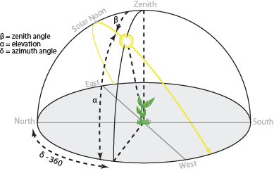

# Solar Calculation
Calculations are taken from the link below.
  - https://gml.noaa.gov/grad/solcalc/calcdetails.html



### Variables

* `Latitude` (+ to N) (as $B$3)
* `Longitude` (+ to E) (as $B$4)
* `Time Zone` (+ to E) (as $B$5)
* `Date` (Month/Day/Year)
* `Time` (Hour:Minute:Second) (as E2)
* `Julian Day`
* `Julian Century` (as G2)

* `Geom Mean Long Sun (deg)` (as I2)
```
MOD(
  280.46646 + G2 * (36000.76983 + G2 * 0.0003032),
  360
)
```

* `Geom Mean Anom Sun (deg)` (as J2)
```
357.52911 + G2 * (35999.05029 - 0.0001537 * G2)
```

* `Eccent Earth Orbit` (as K2)
```
0.016708634 - G2 * (0.000042037 + 0.0000001267 * G2)
```

* `Sun Eq of Ctr` (as L2)
```
SIN(RADIANS(J2)) * (1.914602 - G2 * (0.004817 + 0.000014 * G2)) +
SIN(RADIANS(2 * J2)) * (0.019993 - 0.000101 * G2) +
SIN(RADIANS(3 * J2)) * 0.000289
```

* `Sun True Long (deg)` (as M2)
```
I2 + L2
```

* `Sun True Anom (deg)` (as N2)
```
J2 + L2
```

* `Sun Rad Vector (AUs)`
```
(1.000001018 * (1 - K2 * K2)) / (1 + K2 * COS(RADIANS(N2)))
```

* `Sun App Long (deg)` (as P2)
```
M2 - 0.00569 - 0.00478 * SIN(RADIANS(125.04 - 1934.136 * G2))
```

* `Mean Obliq Ecliptic (deg)` (as Q2)
```
23 + (26 + ((21.448 - G2 * (46.815 + G2 * (0.00059 - G2 * 0.001813)))) / 60) / 60
```

* `Obliq Corr (deg)` (as R2)
```
Q2 + 0.00256 * COS(RADIANS(125.04 - 1934.136 * G2))
```

* `Sun Rt Ascen (deg)`
```
DEGREES(
  ATAN2(
    COS(RADIANS(P2)),
    COS(RADIANS(R2)) * SIN(RADIANS(P2))
  )
)
```

* `Sun Declin (deg)` (as T2)
```
DEGREES(
  ASIN(SIN(RADIANS(R2)) * SIN(RADIANS(P2)))
)
```

* `var y` (as U2)
```
TAN(RADIANS(R2 / 2)) * TAN(RADIANS(R2 / 2))
```

* `Eq of Time (minutes)` (as V2)
```
4 * DEGREES(
  U2 * SIN(2 * RADIANS(I2))
  -2 * K2 * SIN(RADIANS(J2))
  +4 * K2 * U2 * SIN(RADIANS(J2)) * COS(2 * RADIANS(I2))
  -0.5 * U2 * U2 * SIN(4 * RADIANS(I2))
  -1.25 * K2 * K2 * SIN(2 * RADIANS(J2))
)
```

* `HA Sunrise (deg)` (as W2)
```
DEGREES(
  ACOS(
    COS(RADIANS(90.833)) / (COS(RADIANS($B$3)) * COS(RADIANS(T2))) - TAN(RADIANS($B$3)) * TAN(RADIANS(T2))
  )
)
```

* `Solar Noon (LST)` (as X2)
```
(720-4*$B$4-V2+$B$5*60)/1440
```

* `Sunrise Time (LST)`
```
X2 - W2 * 4 / 1440
```

* `Sunset Time (LST)`
```
X2 + W2 * 4 / 1440
```

* `Sunlight Duration (minutes)`
```
8 * W2
```

* `True Solar Time (min)` (as AB2)
```
MOD(
  E2 * 1440 + V2+4 * $B$4 - 60 * $B$5,
  1440
)
```

* `Hour Angle (deg)` (as AC2)
```
if (AB2 / 4 < 0)
  AB2 / 4 + 180
else
  AB2 / 4 - 180
```

* `Solar Zenith Angle (deg)` (as AD2)
```
DEGREES(
  ACOS(
    SIN(RADIANS($B$3)) * SIN(RADIANS(T2)) + COS(RADIANS($B$3)) * COS(RADIANS(T2)) * COS(RADIANS(AC2))
  )
)
```

* `Solar Elevation Angle (deg)` (as AE2)
```
90 - AD2
```

* `Approx Atmospheric Refraction (deg)` (as AF2)
```
IF(AE2 > 85,
  0,
  IF(AE2 > 5,
    58.1 / TAN(RADIANS(AE2)) - 0.07 / POWER(TAN(RADIANS(AE2)), 3) + 0.000086 / POWER(TAN(RADIANS(AE2)), 5),
    IF(AE2 > -0.575,
      1735 + AE2 * (-518.2 + AE2 * (103.4 + AE2 * (-12.79 + AE2 * 0.711))),
      -20.772 / TAN(RADIANS(AE2))
    )
  )
) / 3600
```

* `Solar Elevation corrected for atm refraction (deg)`
```
AE2 + AF2
```

* `Solar Azimuth Angle (deg cw from N)`
```
IF(AC2 > 0,
  MOD(
    DEGREES(
      ACOS(
        ((SIN(RADIANS($B$3)) * COS(RADIANS(AD2))) - SIN(RADIANS(T2))) / (COS(RADIANS($B$3)) * SIN(RADIANS(AD2)))
      )
    ) + 180,
    360
  ),
  MOD(
    540 - DEGREES(
      ACOS(
        ((SIN(RADIANS($B$3)) * COS(RADIANS(AD2))) - SIN(RADIANS(T2))) / (COS(RADIANS($B$3)) * SIN(RADIANS(AD2)))
      )
    ),
    360
  )
)
```
